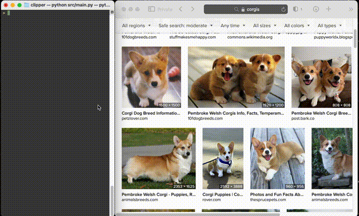

# Clipper


Clipper is designed to provide a seamless and intuitive chat experience, leveraging clipboard content to enhance the context and relevance of interactions with a local language model.

The application continuously monitors the system clipboard for new content, detecting both text and image data copied to the clipboard. Upon detecting an image, Clipper then includes it in the chat query, enhancing the assistant's ability to provide relevant responses. For text content, it appends the clipboard text to the user's query for a comprehensive interaction.

## Installation

1. **Clone the repository**:
   ```sh
   git clone https://github.com/3keston/clipper
   cd clipper
   ```

2. **Create and activate a virtual environment**:
   ```sh
   python -m venv venv
   source venv/bin/activate   # On Windows use `venv\Scripts\activate`
   ```

3. **Install the required dependencies**:
   ```sh
   pip install -r requirements.txt
   ```

4. **Install Ollama and download the required model**:
   - Visit [Ollama's website](https://ollama.com/) and follow the instructions to install Ollama.
   - Pull the required model:
     ```sh
     ollama pull llava-phi3 # or another vision model like llava-llama3, then update the config.py
     ```

## Usage

After completing the installation steps, you can start the application with the following command:

```sh
python src/main.py
```

### How to Use Clipper

- **Copy an Image to Clipboard**: You can copy an image by right-clicking on it and selecting "Copy Image". On Mac, you can also use the screenshot tool by pressing `Cmd + Shift + 4` and selecting the area you want to capture. By default, the captured image is saved to the desktop. To copy the screenshot directly to the clipboard, press `Cmd + Shift + Ctrl + 4` instead, then select the area you want to capture. The captured image will be automatically copied to the clipboard.

  If you prefer to change the default behavior so that screenshots are always copied to the clipboard:
  1. Open the Screenshot app by searching for "Screenshot" in Spotlight (Cmd + Space) or by going to Applications > Utilities > Screenshot.
  2. Click on "Options".
  3. Under the "Save to" section, select "Clipboard".
  4. Close the Screenshot app.

  Now, when you use `Cmd + Shift + 4` and select an area, the screenshot will be copied to the clipboard by default.

- **Copy Text to Clipboard**: Simply select the text you want to copy and use the copy command (usually `Cmd + C` on Mac or `Ctrl + C` on Windows). The copied text will be included in your chat query for a more comprehensive interaction.

### Demo



## Troubleshooting

### Issue: Screenshots are not copied to the clipboard
- **Cause**: By default, the Mac screenshot tool saves screenshots to the desktop instead of copying them to the clipboard.
- **Solution**: Make sure you are using the correct keyboard shortcut `Cmd + Shift + Ctrl + 4` to copy screenshots to the clipboard. If you want to set the default behavior to copy to the clipboard, follow these steps:
  1. Open the Screenshot app by searching for "Screenshot" in Spotlight (Cmd + Space) or by going to Applications > Utilities > Screenshot.
  2. Click on "Options".
  3. Under the "Save to" section, select "Clipboard".
  4. Close the Screenshot app.
